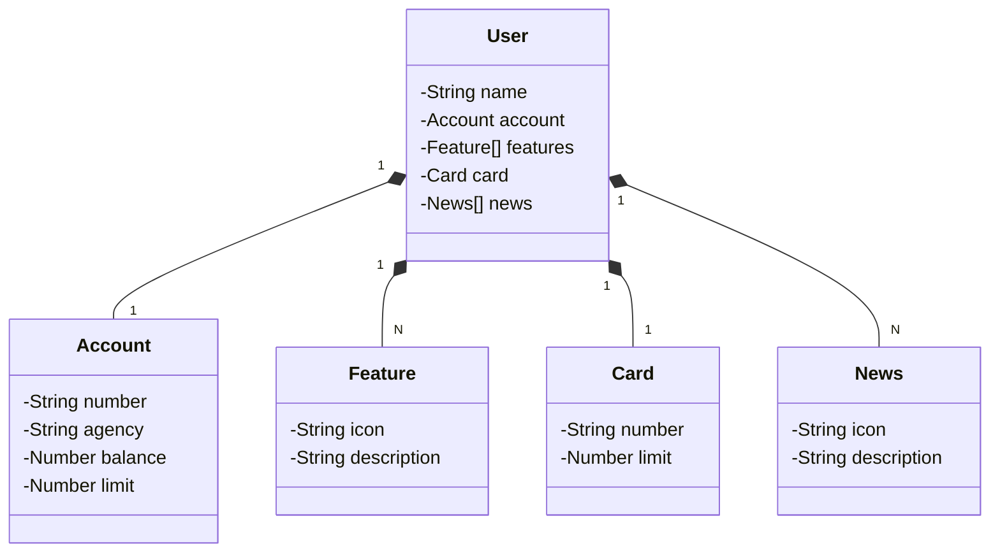

# SANTANDER BACKEND COM JAVA - RESTful API

Seja bem-vindo(a) ao projeto **Publicando sua API REST na Nuvem Usando Spring Boot 3, Java 17 e Railway**, uma API REST construída do zero com tecnologias modernas, pronta para entregar funcionalidades robustas e escaláveis! 💡

## 📚 Sobre o projeto

Este projeto foi desenvolvido como parte de um desafio com o objetivo de aplicar os conhecimentos em Java 17 e Spring Boot 3. Utilizamos uma combinação de ferramentas poderosas para garantir produtividade, boa estrutura e escalabilidade.

### 🧩 Tecnologias utilizadas

- 💻 **Java 17** — versão LTS cheia de recursos modernos
- ⚙️ **Spring Boot 3** — agilidade e autoconfiguração na veia
- 🗃️ **Spring Data JPA** — integração simples com bancos SQL
- 📑 **OpenAPI (Swagger)** — documentação clara e interativa da API
- ☁️ **Railway** — deploy ágil e fácil na nuvem
- 🐘 **PostgreSQL** e 🧪 **H2** — bancos de dados utilizados

## Diagrama de Classes

## 🧑‍💻 Autor(a)

Projeto desenvolvido por [Ilanna](https://github.com/ilannakarla).
Inspirado por desafios de aprendizado e aprimoramento em Java e POO.
---
